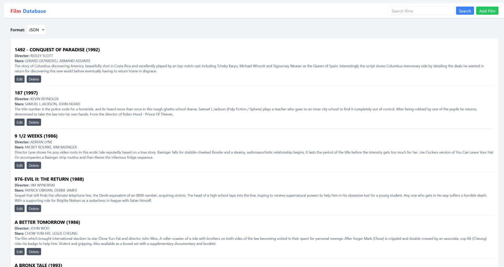
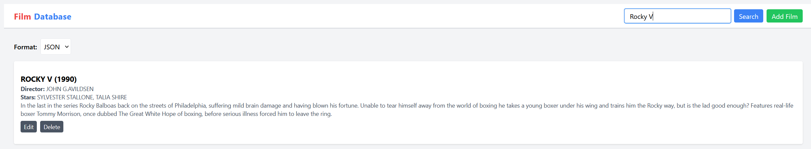
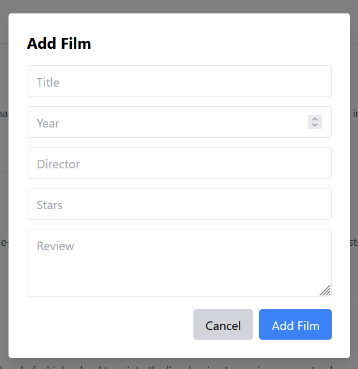
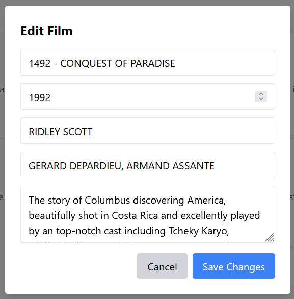

# Film Database RESTful Application

A full-stack film database application developed using Java, REST APIs and React. The project demonstrates CRUD operations, MVC architecture, asynchronous frontend data handling and relational database integration.

## Live Demo

A static frontend demonstration of the application is available here:

🔗 https://filmdatabasestatic.netlify.app

**Note:** The live demo uses sample data to showcase the user interface and frontend functionality. The full Java/Tomcat backend and MySQL integration are included in this repository.

## Technologies Used

- Java
- React
- JavaScript
- Tailwind
- REST APIs
- MySQL
- Apache Tomcat 9
- JSP / Servlets
- GSON
- JDBC

---

## Features

- Retrieve all films from the database
- Search films by title or ID
- Insert new film records
- Update existing films
- Delete films from the database
- JSON, XML and plain text API responses
- React frontend communicating with REST API using Fetch API

---

## Screenshots

### Homepage



### Search Functionality



### Add Film



### Edit Film



---

## Database Configuration

Database credentials and configuration files have been omitted from this repository for security reasons.

To run the application locally, configure your own MySQL database connection inside:

src/dao/FilmDAO.java

---

## REST API Endpoints

| Method | Endpoint | Description |
|---|---|---|
| GET | `/Filmsapi?format=json` | Retrieve all films |
| GET | `/Filmsapi?id=1&format=json` | Retrieve film by ID |
| GET | `/Filmsapi?title=titanic&format=json` | Search films |
| POST | `/Filmsapi` | Insert new film |
| PUT | `/Filmsapi` | Update existing film |
| DELETE | `/Filmsapi?id=1` | Delete film by ID |

---

## Example JSON Body

```json
{
  "id": 0,
  "title": "Film Title",
  "year": 2024,
  "director": "Director Name",
  "stars": "Actor Names",
  "review": "Film review"
}

